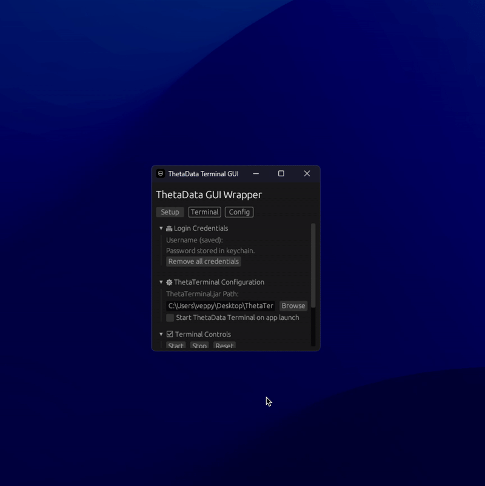

# ThetaData Terminal GUI

A sleek, modern, and cross-platform GUI wrapper for the ThetaData Terminal. Built in Rust with [eframe/egui](https://github.com/emilk/egui), this application transforms the thetadata.jar into an clean, user-friendly adventure.




## Overview

**ThetaData Terminal GUI** is designed to simplify and streamline the interaction with ThetaData Terminal. Key features include:
- **Secure Credential Management:** Store and manage your login credentials securely using your system keychain.
- **Intuitive Interface:** Navigate effortlessly through Setup, Terminal, and Configuration tabs with a visually appealing dark theme.
- **Real-time Logging:** Monitor live terminal output with an integrated log viewer that updates dynamically.
- **Process Control:** Start, stop, and reset your ThetaData Terminal instance with just one click.
- **Customizable Settings:** Easily set your JAR path, toggle auto-start on launch, and choose your default view.

## Features

- **User-Friendly Design:** Clean, minimalistic interface with thoughtful navigation.
- **Integrated Security:** Leverages keyring for safe storage of your credentials.

## Installation

Download the latest build from the downloads pane.

Alternatively, clone and build the project yourself:

```bash
git clone https://github.com/veppy1/thetadata_terminal_gui.git
cd thetadata_terminal_gui
cargo build --release
```

Then run the generated binary from the `target/release/` directory.

## Getting Started

1. **Configure Your Credentials:**
   - Enter your username and password in the Setup tab.
   - Save your credentials securely in the system keychain.
2. **Set Up ThetaTerminal:**
   - Specify the path to your `ThetaTerminal.jar` using the file browser.
   - Enable auto-start if desired.
3. **Control Your Terminal:**
   - Use the Terminal tab to start, stop, or reset the terminal process.
   - Monitor live logs and copy outputs as needed.

## License

This project is licensed under the [MIT License](LICENSE).

## Contact

veppy.eth on discord!
